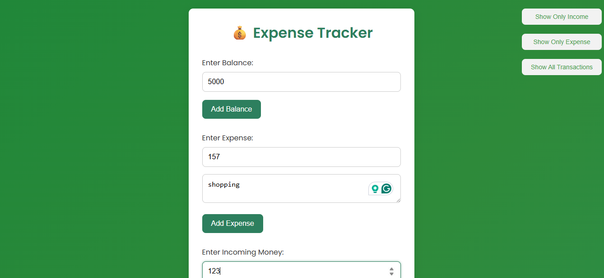

# 💰 Track Expenses App

A lightweight and responsive **Expense Tracker** web application built using **HTML**, **CSS**, and **JavaScript**. It allows users to log income and expenses, view balance updates in real-time, and manage finances better.

---

## 🔗 Live Demo
👉 [Click here to visit the live site](https://magenta-jelly-3ea2fc.netlify.app/)

## Screenshots-
#### Home Page

## 🚀 Features

- ➕ Add income and expense transactions
- 🧾 List of recent transactions with amount
- 🧮 Real-time balance updates
- ❌ Delete individual transactions
- 💾 Data saved using **Local Storage**
- 📱 Fully responsive layout for desktop and mobile

---

## 🧠 What I Learned

- Handling arrays & dynamic DOM updates with JavaScript
- Using **Local Storage** to persist data
- Designing clean and responsive UIs
- Enhancing interactivity using JS event listeners

---

## 📚 Tech Stack

- **HTML**
- **CSS** (Flexbox + Responsive design)
- **JavaScript** (Vanilla JS for logic)

---

## 🛠️ Future Improvements

- Export data as CSV
- Add charts using Chart.js
- Add authentication to make it multi-user

---

## ✍️ Author

**Mohd. Shehzad**  
GitHub: [@ShehzadChouhan](https://github.com/ShehzadChouhan)

---

